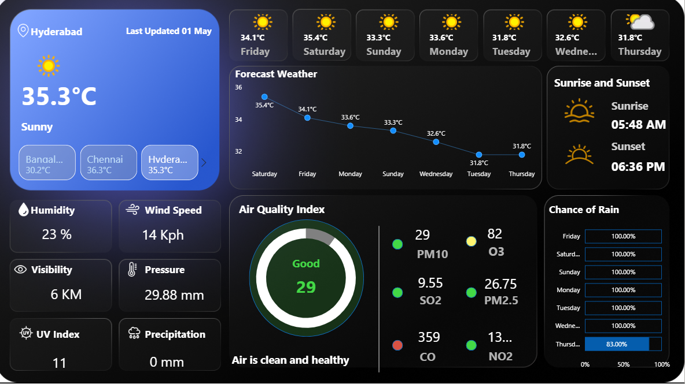

# 🌦️ Weather Forecast Dashboard (Power BI)

## 📊 Overview
This project is a Power BI dashboard built to analyze weather data such as temperature, humidity, and air quality (PM10) across multiple cities over a one-week period.

## 🎯 Objective
To transform short-term (7-day) weather data into meaningful insights using time-series analysis and visualization techniques.

## 🛠️ Tools Used
- Power BI  
- Power Query  
- Data Visualization  

## 📈 Key Insights
- Observed daily variations in temperature and humidity over one week  
- Compared weather patterns across multiple cities  
- Analyzed air quality trends (PM10) across days  

## 📊 Features
- 7-day time-series analysis of weather data  
- Multi-city comparison  
- Clear and structured visualizations  
- Interactive dashboard design  

## 📷 Dashboard Preview
Below is a snapshot of the Power BI dashboard:

## 📁 Files Included
- Weather_Dashboard.pbix  

## 📡 Data Source
The data used in this project is sourced from an external website providing real-time weather information.  
The dashboard is based on one-week (7 days) data, and the dataset is not included due to dynamic updates.

## 🚀 Outcome
This dashboard provides a clear understanding of short-term weather trends and enables comparative analysis across cities.

## 👩‍💻 Created by
Surekha Vaitla
